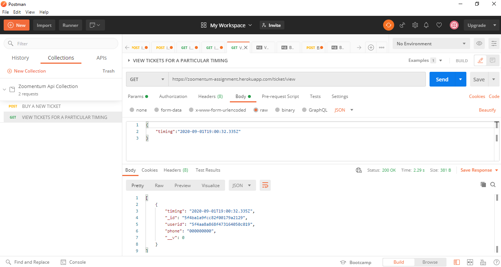

# Zoomentum Project

Implemented an API using express and mongoDB for Zoomentum Hiring Project

## Stack

```
Nodejs  | JavaScript runtime environment for server
Express | Web Application framework for Nodejs
mongodb | As a DBMS to store data of tickets and users.
Agenda  | To implement job scheduling using Nodejs
```

## Schema's

### Tickets

```js
{
  userid: {
    type: mongoose.Schema.Types.ObjectId,
    ref: "User",
    required: true,
  },
  phone: String,
  timing: { type: Date, default: Date.now(), required: true },
}
```

#### **Note**:

1. `userid` is a reference to `_id` in the Users collection
2. Expiry field is not included as the expired tickets will be deleted automatically.This implies that remaining tickets are not expired and this info is not needed to be stored.

### Users

```js
{
  "_id": ObjectID,
  "username": { "type": String, "required": true },
}
```

## Checkpoints

- [x] An endpoint to book a ticket using a user’s name, phone number, and timings.
- [x] An endpoint to update a ticket timing.
- [x] An endpoint to view all the tickets for a particular time.
- [x] An endpoint to delete a particular ticket.
- [x] An endpoint to view the user’s details based on the ticket id.
- [x] Mark a ticket as expired if there is a diff of 8 hours between the ticket timing and current
      time. [See note](#note)
- [x] For a particular timing, a maximum of 20 tickets can be booked.
- [x] Create a proper readme for your project.
- [x] Plus point if you could delete all the tickets which are expired automatically.
- [x] Plus point if you could write the tests for all the endpoints. `Test written in Postman`
- [x] Please attach a screenshot of your postman while testing your application. `Postman document collection made instead of screenshot. It contains example for all the APIs. https://documenter.getpostman.com/view/12534810/TVCcXp4o`

## API

Documentation about the API is hosted as a collection on Postman. It also includes examples.

### https://documenter.getpostman.com/view/12534810/TVCcXp4o

## Screenshot



> This is a sample screenshot.

---

_Readme template provided by [Github/il3ven](https://github.com/il3ven/)_
